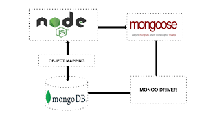

# chrip-chirp
A social-media-platform

To view this application in action, feel free to visit the link below:
https://drive.google.com/file/d/14uLmusN8GFKrucZsxmGUGAx7Grj0nK5v/view

  #Table of Content
  - [description](#Description)
  - [installation](#Installation)
  - [usage](#Usage)
  - [credits](#Credits)
  - [license](#License)
  - [contact](#Contact)

  ## Description:
  The purpose behind this project was to create a social media platform utilizing a NoSQL database so that my website can handle large amounts of unstructured data. 

 
  Below I have attached a diagram to help conceptualize how MongoDB, Mongoose and Nodejs all work together to help build this application. 

   

  ## Installation:
  In order to be create this application the following technologies were utilized:
    - MongoDB 
    - Express 
    - Mongoose 

    If you would like to utilize Express or Mongoose on your next project, I have listed the commands to install them below: 
    - Express ---> npm i express
    - Mongoose ---> npm i mongoose

  In order to view how a user can add a friend or delete a friend from their friend list view the gif below:
  

  Below, I have displayed how a schema is create for the models:
  

  The model above references the reaction schema inside of it.  
  I wanted to reference this above in order to provide an example of how relationships are made between schemas when using MongoDB.  
  Below is the reaction schema for reference:

  

  Below I have include an image of the API route that allows you to update a thought:

  

  Below I have include an image of the API route that allows you to delete a thought:

  

  Below I have include an image of the API route that allows you to delete a reaction that you published on a users thought:
  I personally found this route intresting because instead of finding a thought a removing it you actually want to update it because you do not want to remove the whole thought, you only want to remove a single reaction made on the thought.

  

  ## Usage:
  This application does not contain a frontend, therefore you will need to download this repository to be able to test the functionality of this application. I used Insomnia in order for me to be able to test that the routes of this application were working properly.
  The following API routes on Insomnia should work like this: 
  When I test the API GET routes in Insomnia for users and thoughts then the data for each of these routes is displayed in a formatted JSON
  When I test API POST, PUT, and DELETE routes in Insomnia then I am able to successfully create, update, and delete users and thoughts in my database.
  When I test API POST and DELETE routes in Insomnia then I am able to successfully create and delete reactions to thoughts. 
 

  ## Credits:
  Mongoose image provided by: https://dev.to/oluseyeo/how-to-create-relationships-with-mongoose-and-node-js-11c8
  I utilized https://gist.github.com/lukas-h/2a5d00690736b4c3a7ba to generate markdown license badges.

 
  ## License:
  MIT 

  ## Contact:
  allleizq@gmail.com